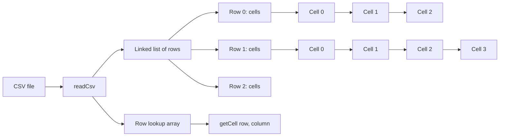

# csvParser

[](https://github.com/ChrisMcGowanAu/csvParser/actions/workflows/super-linter.yml)
[](https://github.com/ChrisMcGowanAu/csvParser/actions/workflows/c-cpp.yml)
[](https://github.com/ChrisMcGowanAu/csvParser/actions/workflows/github-code-scanning/codeql)

A small CSV parser written in C, with a thin C++ wrapper.

`csvParser` was originally written for embedded-style C projects where predictable behaviour, simple data structures, and direct access to parsed values mattered more than pulling in a large dependency. It reads a CSV file into a linked structure of rows and cells, then builds a row lookup table so cells can be accessed by row and column.

It was created after running into awkward behaviour with stateful tokenising functions such as `strtok()` and `strsep()`. Rather than splitting strings with library tokenisers, this parser walks the input itself and tracks CSV quoting state.

## Data structure

There is no GUI for this project, so the most useful visual is a structure diagram rather than a screenshot:



Internally, the parsed CSV is stored like this:

```text
Row 0 -> Cell 0 -> Cell 1 -> Cell 2
  |
Row 1 -> Cell 0 -> Cell 1 -> Cell 2 -> Cell 3
  |
Row 2 -> Cell 0 -> Cell 1
```

After parsing, an array of row pointers is built. This gives fast row lookup while still allowing each row to contain a different number of cells.

## Features

* Written in C
* Usable from C and C++
* No external library dependencies
* Supports custom separators
* Handles quoted CSV fields, including separators inside quoted fields
* Handles multi-line quoted cells
* Stores rows and cells in linked lists
* Builds a row lookup array for faster row access
* Supports ragged CSV files where rows have different numbers of columns
* Provides cell status information for empty cells, missing rows, and missing columns
* Intended for direct cell access rather than streaming output only

## Current scope

This parser is designed to be small, direct, and easy to embed in C/C++ projects. It reads the whole CSV file into memory, so maximum file size is limited by available RAM.

The parser aims to handle common RFC 4180-style CSV files and CSV files produced by tools such as Excel. It is not intended to be a full replacement for large, feature-rich CSV libraries.

If exact RFC 4180 behaviour is important for your project, add tests for the edge cases you depend on, especially around quote escaping, embedded newlines, empty cells, and trailing fields.

## Files

Core parser:

```text
csvParser.h
csvParser.c
```

C test/example program:

```text
csvTest.c
```

C++ test/example program:

```text
csvTest.cpp
```

The C++ build uses the same parser implementation through `csvParser.cpp`, which is a link to `csvParser.c`.

## Building

This project uses CMake.

```bash
cmake -S . -B build
cmake --build build
```

This builds two example programs:

```text
build/cParserTest
build/cppParserTest
```

## Running the examples

C example:

```bash
./build/cParserTest example.csv
```

C++ example:

```bash
./build/cppParserTest example.csv
```

Both examples read a CSV file and write the parsed data back to standard output.

## Basic C usage

```c
#include "csvParser.h"
#include <stdio.h>

int main(void) {
    CsvType *csv = readCsv("example.csv", ',');
    if (csv == NULL) {
        return 1;
    }

    printf("Rows: %u\n", numRows(csv));
    printf("Columns: %u\n", numCols(csv));

    CsvCellType cell = getCell(csv, 0, 1);
    if (cell.status == normalCell) {
        printf("Cell value: %s\n", cell.cellContents);
    }

    freeMem(csv);
    return 0;
}
```

Rows and columns use C-style zero-based indexes:

```text
row 0, column 0 = first cell
row 0, column 1 = second cell
row 1, column 0 = first cell on second row
```

## Basic C++ usage

```cpp
#include "csvParser.h"
#include <cstdio>

int main() {
    CsvClass csv;
    char filename[] = "example.csv";

    if (!csv.ReadCsv(filename, ',')) {
        return 1;
    }

    std::printf("Rows: %u\n", csv.NumRows());
    std::printf("Columns: %u\n", csv.NumCols());

    CsvCellType cell = csv.GetCell(0, 1);
    if (cell.status == normalCell) {
        std::printf("Cell value: %s\n", cell.cellContents);
    }

    return 0;
}
```

## Cell status

`getCell()` returns a `CsvCellType` structure:

```c
typedef struct CsvCellType {
    uint32_t bytes;
    CellStatusType status;
    bool lastCellInRow;
    char *cellContents;
} CsvCellType;
```

The `status` field tells you whether the requested cell was found:

| Status       | Meaning                                         |
| ------------ | ----------------------------------------------- |
| `normalCell` | The cell exists and contains data               |
| `emptyCell`  | The cell exists but is empty                    |
| `missingRow` | The requested row does not exist                |
| `missingCol` | The requested column does not exist in that row |

`cellContents` is owned by the parser. Do not free it yourself. Call `freeMem(csv)` when finished with the parsed CSV.

## Performance notes

The parser has been tested during development with large CSV files, including files with hundreds of thousands of rows.

The storage model is designed around this access pattern:

```c
cell = getCell(csv, row, column);
```

Row access is fast because of the row lookup array. Column access walks the linked list of cells in that row, so accessing a very high column number is linear in the width of that row.

For most CSV files, especially files with many rows and a moderate number of columns, this is a useful compromise between memory layout simplicity and direct cell access.

## Testing ideas

CSV edge cases are where parsers earn their boots. Useful test files include:

```csv
a,b,c
1,2,3
```

```csv
,a,b
,,c
a,b,
```

```csv
"a,b",c
"a ""quoted"" word",x
```

```csv
"multi
line",x,y
```

```csv
a,b,c
1,2,3
last,line,no_final_newline
```

```csv
"unterminated quoted field,a,b
```

Recommended test styles:

* Compare parser output with expected output.
* Test direct `getCell()` access.
* Test empty cells and trailing empty cells.
* Test files with and without a final newline.
* Test quoted fields containing separators.
* Test quoted fields containing newlines.
* Test malformed input and confirm that failure behaviour is predictable.

For memory checking during development, AddressSanitizer is useful:

```bash
cmake -S . -B asan-build \
  -DCMAKE_BUILD_TYPE=Debug \
  -DCMAKE_C_FLAGS="-fsanitize=address,undefined -g -O1" \
  -DCMAKE_CXX_FLAGS="-fsanitize=address,undefined -g -O1"

cmake --build asan-build
./asan-build/cParserTest example.csv
```

## Design goals

The design goals are deliberately simple:

* Keep the parser small.
* Keep the C API easy to call.
* Avoid external dependencies.
* Avoid `strtok()` and `strsep()` tokenisation.
* Preserve direct access to individual cells.
* Support C first, with a lightweight C++ wrapper.

## Possible future improvements

* Add a formal test suite with expected results.
* Add generated large-file benchmark tests.
* Tighten malformed CSV error reporting.
* Decide whether returned cells should be raw CSV text or decoded values.
* Improve bounds checking and memory-safety checks.
* Add CI builds using AddressSanitizer.

## License

MIT License. See [LICENSE](LICENSE).

